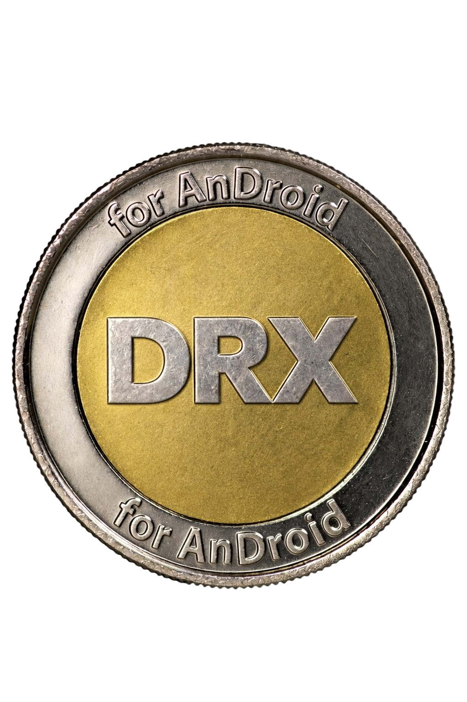

# droid--drx-
Droid (DRX) je experimentální kryptoměna napsaná v programovacím jazyce Python, a je určená pro zařízení s operačním systémem Android.

Požadované závislosti:

pkg update && pkg upgrade -y
pkg install python-cryptography -y
pip install ecdsa colorama

Současný stav projektu:

**Běžný provoz**

Těžba, transakce, P2P sync, peněženky, persistence, balance tracking — to vše funguje a je vzájemně konzistentní.

**Časté útoky — pokryto**

- Falešný PoW bez reálného hledání nonce ✓
- Double-spend v bloku i v celém řetězci ✓
- Falešný podpis nebo cizí public key ✓
- Podvržený merkle root nebo TX ID ✓
- COINBASE injekce do mempoolu ✓
- Nonce replay ✓
- Rate limiting + blacklist agresivních uzlů ✓
- DoS přes oversized zprávy ✓
- Sybil přes MAX_PEERS limit ✓
- Checkpoint ochrání genesis a hardcoded bloky ✓
- Tampered blockchain.db detekován při startu ✓

**Běžné uživatelské chyby — pokryto**

- Nedostatečný zůstatek ✓
- Špatný formát adresy ✓
- Posílání sama sobě ✓
- Špatná výše poplatku ✓
- Špatné heslo k peněžence ✓
- Poškozená DB → graceful exit ✓
